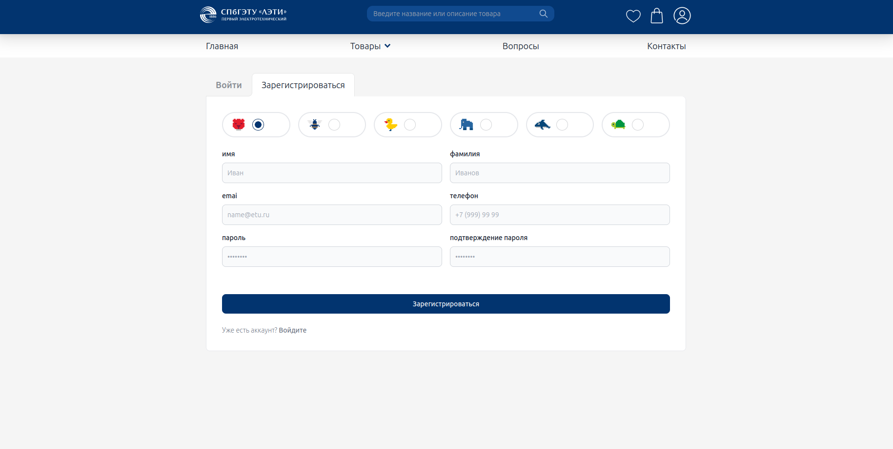

# Прототип интернет-магазина мерча LETI.

Разработанный с использованием Spring Framework, Hibernate, Spring Boot 3.1.5, Spring Security 6 и PostgreSQL, Mariadb,
Docker.

## Диаграмма базы данных


## Реализованы следующие страницы интернет-магазина:


- Главная страница
- Страница о нас
- Страница с товарами
- Страница с карточкой товара
- Корзина товаров
- Личный кабинет
- Категории
- Подкатегории
- Страница аутентификации/авторизации пользователя:

## Функциональность

Приложение предоставляет следующую функциональность:

- Главная страница:
    - Здесь пользователь может ознакомиться с информацией о магазине, его услугах и преимуществах.

- Страница о нас:
    - Здесь представлена информация о магазине, его истории, команде и целях.

- Страница с товарами:
    - Здесь пользователь может просмотреть список доступных товаров и их характеристики.
    - Имеется возможность добавить товар в корзину.

- Страница с карточкой товара:
    - Здесь представлена дополнительная информация о выбранном товаре, его изображение и возможность его добавить в
      корзину.

- Корзина товаров:
    - Здесь пользователь может просмотреть список добавленных в корзину товаров.
    - Имеется возможность изменить количество товаров и удалить товар из корзины.
    - При перезагрузке страницы товары, добавленные в корзину, сохраняются.

- Поиск по товарам:
    - Пользователь имеет возможность осуществлять поиск по названию товара или его характеристикам.

- Страница аутентификации/авторизации пользователя:
    - Разработан механизм регистрации с использование Spring Security -> реализована регистрация, авторизация(
      ROLE_USER,ROLE_ADMIN),аутентификация.

## Взятые за основу требования

- Спроектирована модель данных и схема БД на основе функционала интернет магазина. Отображена модель данных на uml
  диаграмме.
- Общение с серверной частью происходит через HTTP API, которое Stateless.
- Для авторизации/аутентификации использован JWT токен.
- Развертывание в Docker-контейнере.

## Архитектура REST API, HTTPS, Spring Boot MVC

Архитектура REST API приложения состоит из следующих компонентов:

- Клиентский слой:
    - Реализован на Vue 3.
    - Отвечает за визуальное представление данных и взаимодействие с пользователем.

- Серверный слой:
    - Реализован на Spring Boot.
    - Отвечает за обработку запросов от клиента и взаимодействие с базой данных.
    - Использует MVC архитектурный шаблон для разделения бизнес-логики, модели и представления.

- База данных:
    - Используется MariaDB или PostgreSQL для хранения информации о пользователях, товарах и заказах.

## Архитектурный шаблон MVC

 

Модель (Model), представление (View) и контроллер (Controller).

Модель (Model) представляет собой компонент, который отвечает за обработку данных и бизнес-логику приложения. Он
содержит информацию и методы для работы с этой информацией. Модель не зависит от представления и контроллера, что
позволяет ей быть независимой и переиспользуемой.

Представление (View) отвечает за отображение данных модели пользователю. Оно представляет собой пользовательский
интерфейс, через который пользователь может взаимодействовать с приложением. Представление получает данные от модели и
отображает их пользователю. Оно не содержит бизнес-логики и не изменяет данные модели.

Контроллер (Controller) является посредником между моделью и представлением. Он получает запросы от пользователя через
представление, обрабатывает эти запросы, взаимодействует с моделью для получения или изменения данных и обновляет
представление с новыми данными. Контроллер также может выполнять дополнительные действия, такие как валидация данных или
управление навигацией.

## Пошаговое прохождение авторизации/аутентификации


## Устройство бекенд сервера с использованием послойного разделения бизнес логики


## Зависимости

Для запуска проекта необходимы следующие зависимости:

- Фронтенд:
    - Vue 3
    - JavaScript
- Бекенд
    - Java 17
    - Spring Framework
    - Hibernate
    - Spring Boot 3.1.5
    - Spring Security 6
    - PostgreSQL
    - Springdoc-openapi-starter-webmvc-ui 2.2.0
    - io.jsonwebtoken
    - Spring-boot-devtools
    - Lombok
    - Mapstruct

## Запуск проекта 

### Бекенд

Для запуска проекта выполните следующие шаги:

1. Клонирование репозитория: Склонируйте репозиторий проекта на свой локальный компьютер.

```
git clone https://gitlab.com/VladSemenovForVibeLab/merch-store -b backend
```

2. Перейдите в директорию проекта, где находится файл Dockerfile.

3. Соберите Docker контейнер:
    ```
    docker compose up
    ```
   так будет выглядить ваша консоль(находитесь в директории с Dockerfile):
   
  

  В Приложении Docker Engine вы сможете увидеть
  

  


4. Перейдите в браузере по адресу
    ```
    https://localhost:8082/swagger-ui/index.html#/ 
    ```
   для доступа к интернет-магазину - к полной реализации ручек-эндпоинтов.

Пожалуйста, обратите внимание, что в данном примере предполагается, что у вас уже установлен Docker. Также необходимо
убедиться, что порт 8082 свободен для использования.

### frontend

1. Клонирование репозитория: Склонируйте репозиторий проекта на свой локальный компьютер.

```
git clone https://gitlab.com/VladSemenovForVibeLab/merch-store -b new_branch
```

2. Перейдите в директорию проекта, где находится файл Dockerfile.

3. Соберите Docker образ с помощтю команды

```
docker build -t frontend .
```


4. Проверьте, собрался ли ваш образ: сделать это можно с помощью команды в консоли Ubuntu
```
docker images
```
- Проверять все это стоит при запущенном Docker


5. Запустите одиноко одно изображение с помощью команды:

```
docker run --rm --name frontend_v1 -p 5173:5173 -d frontend
```

- так выглядит данное действие


6. Теперь в Docker Engine можно посмотреть созданные контейнеры: 


7. Для остановки контейнера с консоли нужно выполнить данную команду

```
docker stop frontend_v1
```

- так это будет выглядить


### Дополнительно
- Можно запустить контейнер чтобы он запускался при включении системы автоматически
```
docker run --name frontend_v1 --restart=always -p 5173:5173 -d frontend
```


## Руководство по использованию
 Так выглядит начальный экран при запуске Docker контейнера и открытие страницы по адресу
```
https://localhost:8082/swagger-ui/index.html#/
```


Далее возможно для тестирования приложения зайти по пароли и почте администратора:
Для этого нажмите на кнопку 'Try it Out' и введите данные
```agsl
{
  "email": "admin@example.com",
  "password": "admin"
}
```
 Так это будет выглядить в Swagger OpenApi
 

Затем вы получите токен JWT - аутентификации и авторизации, который необходимо вставить по нажатии на кнопку 
```agsl
Authorize
```
Так выглядит данное всплывающее окно


Затем можно тестировать дальнейшие endpoints

Например 
### Получение всех новых продуктов в размере 10 штук


### Пример регистрации


### Пример аутентификации/авторизации


### Пример редактирования личного кабинета user


```agsl
Стоит заметить что ADMIN редактирует любой профиль, обычный пользователь же может редактировать лишь свой аккаунт
```

### Пример создания пользователя администратором


Функция может понадобиться для тестирования 

### Поиск пользователей в диапазоне времени создания


- Функционал реализован для администраторов

### Проверка роли пользователя 


- Каждый пользователь вошедший в систему -> прошедший аутентификацию может проверять свою роль

### Поиск пользователя по userId


- Данный функционал позволяет найти пользователя по id, при этом если ваша роль USER -> вы можете найти лишь себя, ADMIN -> любого пользователя

### Поиск всех пользователей


- Данным функционал обладают пользователи с ролью ROLE_ADMIN.

### Поиск всех пользователей по ключевым словам с использованием пагинации


- Данный функционал реализован для администраторов, можно найти пользователей по имени или города(данные можно расширить при необходимости)

### Удаление пользователя по id

- Данным функционалом может воспользоваться как обычный пользователь со своим аккаунтом, так и администратор
- Администратор может удалить любого пользователя
- Пользователь может удалить лишь свой аккаунт


## Готовое задание

В рамках данного задания были разработаны основные функциональные компоненты магазина мерча ЛЭТИ, включая главную
страницу, страницу о нас, страницу с товарами, страницу с карточкой товара, корзину товаров и возможность их
редактирования, а также поиск по товарам. Также был реализован механизм регистрации, авторизации, аутентификации.

### Реализация 

- Главная страниц: На ней предоставлены Новинки в магазине и выбранные подкатегории
- В футаре страницы предоставлены все категории интернет магазина


- Страница Контакты - о нас: предоставлена почта, местоположение, телефон и координаты нахождения учреждения


- Часто задаваемы вопросы: то, что необходимо для реального интернет-магазина для предотвращения множества проблем с поддержкой


- Страницы с товарами: были реализованы страницы по категориям - можно увидеть товары лежащие в категории(Вся одежда)
- Также и по подкатегориям(Только футболки)


- Страница с продуктами в подкатегории Свитшоты


- Страница с продуктами в категории Аксессуары


- Страница с карточкой товара: в ней представлено описание продукта, его цена, скидка и комментарии к нему, производится расчет средней оценки и скидки.
- Можно с данной страницы добавить товар как в корзину так и в избранное интернет магазина.


- Страница корзины с возможностью редакирования: добавления продуктов, увеличения их количества, уменьшения, удаления продукта из корзины


- Поиск по товарам осуществляется в шапке по описанию и названию продуктов

- Страница регистрации: регистрация как и все endpoints реализованы с помощтю фронтенда и бекенда, поэтому регистрация реализована с помощью Spring Security 6, JWT 



- Страница аутентификации/авторизации 


